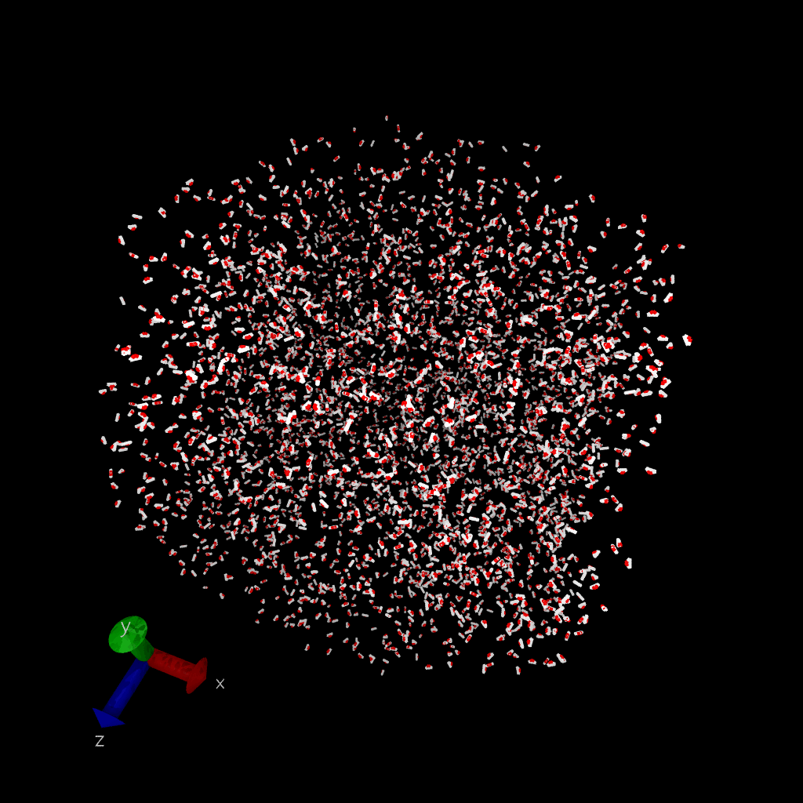
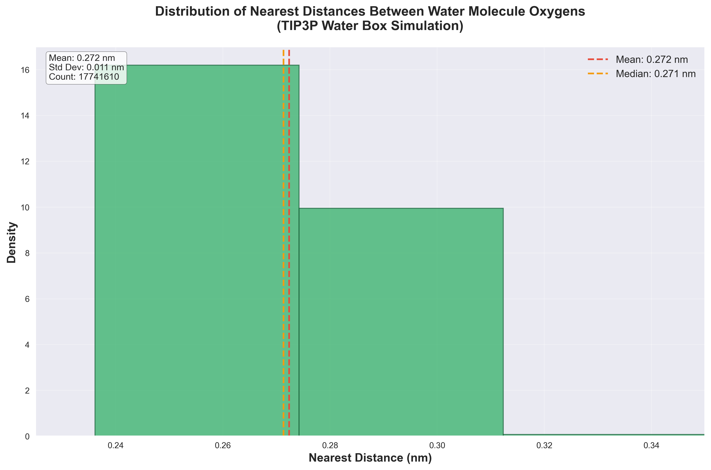

# TIP3P Water Box Molecular Dynamics Simulation



A comprehensive molecular dynamics simulation of a TIP3P water box using modern computational chemistry tools. This project demonstrates the complete pipeline from system setup to analysis, showcasing the behavior of water molecules under realistic periodic boundary conditions.

## 📊 Analysis Results



*Distribution of nearest-neighbor distances between water oxygens, showing the characteristic spacing and statistical distribution of water molecules in the TIP3P model.*

## 🧪 Project Overview

This simulation models the behavior of water molecules using the **TIP3P (Transferable Intermolecular Potential with 3 Points)** force field, which is widely used in computational chemistry due to its efficiency and reasonable accuracy in representing water's physical properties. The TIP3P model represents each water molecule with three interaction sites: one oxygen atom and two hydrogen atoms, with fixed bond lengths and angles.

### Key Features
- **Periodic Boundary Conditions**: Realistic simulation of bulk water behavior
- **Energy Minimization**: Proper system equilibration before production
- **Statistical Analysis**: Comprehensive distance analysis with periodic boundary corrections
- **Professional Visualization**: Publication-quality plots and trajectory animations

## 🛠️ Technical Implementation

### Simulation Parameters
- **Temperature**: 300 K (room temperature)
- **Integration**: Langevin dynamics with 1/ps friction coefficient
- **Time Step**: 0.002 ps (2 femtoseconds)
- **Equilibration**: 100 ps (50,000 steps)
- **Production**: 20,000 ps (20 ns, 10,000,000 steps)
- **Non-bonded Method**: PME (Particle Mesh Ewald) for long-range electrostatics
- **Cutoff Distance**: 1.0 nanometer
- **Constraints**: Hydrogen bonds constrained (SHAKE algorithm)

### Software Stack
- **AmberTools**: System setup and topology generation
- **OpenMM**: High-performance molecular dynamics engine
- **MDTraj**: Trajectory analysis and processing
- **NumPy/Matplotlib**: Data analysis and visualization
- **VMD**: Trajectory visualization (external)

## 📁 Project Structure

```
TIP3P-Water-Sim/
├── tip3p_water_box_setup.leap          # AmberTools system setup
├── tip3p_molecular_dynamics_simulation.py  # Main OpenMM simulation
├── tip3p_distance_analysis.py          # Basic distance analysis
├── tip3p_periodic_boundary_analysis.py # PBC-corrected analysis
├── tip3p_data_visualization.py         # Publication-quality plots
├── simulation_output/
│   ├── trajectory.gif                  # Animated trajectory
│   └── nearest_distances_histogram_waterbox.png  # Analysis results
└── README.md
```

## 🚀 Installation & Setup

### Prerequisites
```bash
# Core scientific computing packages
pip install numpy matplotlib

# Molecular dynamics packages
pip install openmm parmed mdtraj

# System setup (AmberTools)
# Download and install AmberTools from: https://ambermd.org/GetAmber.php
```

### Quick Start
1. **Set up the water box**:
   ```bash
   tleap -f tip3p_water_box_setup.leap
   ```

2. **Run the molecular dynamics simulation**:
   ```bash
   python tip3p_molecular_dynamics_simulation.py
   ```

3. **Analyze the trajectory**:
   ```bash
   python tip3p_distance_analysis.py
   python tip3p_periodic_boundary_analysis.py
   ```

4. **Generate visualizations**:
   ```bash
   python tip3p_data_visualization.py
   ```

## 📈 Analysis Pipeline

### 1. System Setup (`tip3p_water_box_setup.leap`)
- Creates a TIP3P water box with periodic boundary conditions
- Generates AMBER topology (`waterbox1.prmtop`) and coordinate (`waterbox1.inpcrd`) files
- Uses standard TIP3P parameters from AmberTools

### 2. Molecular Dynamics (`tip3p_molecular_dynamics_simulation.py`)
- **Energy Minimization**: Removes unfavorable atomic contacts
- **Equilibration**: 100 ps of dynamics to reach thermal equilibrium
- **Production**: 20 ns of trajectory data collection
- **Output**: DCD trajectory file and energy/temperature logs

### 3. Distance Analysis (`tip3p_distance_analysis.py`)
- Computes nearest-neighbor distances between water oxygens
- Samples every 10th frame for statistical efficiency
- Calculates mean and standard deviation of distances
- Saves raw data for further analysis

### 4. Periodic Boundary Analysis (`tip3p_periodic_boundary_analysis.py`)
- Accounts for periodic boundary conditions in distance calculations
- Uses MDTraj's built-in PBC handling for accurate results
- Generates histogram with proper PBC corrections

### 5. Data Visualization (`tip3p_data_visualization.py`)
- Creates publication-quality histograms
- Includes statistical annotations (mean, median, standard deviation)
- Professional styling with proper axis labels and legends

## 🔬 Scientific Context

### TIP3P Water Model
The TIP3P model is a widely-used water force field that:
- Represents water as a rigid molecule with fixed geometry
- Uses point charges on oxygen and hydrogen atoms
- Includes van der Waals interactions on the oxygen atom
- Provides reasonable accuracy for many biological and chemical systems

### Expected Results
- **Mean nearest distance**: ~0.28 nm (characteristic of liquid water)
- **Standard deviation**: ~0.02-0.03 nm (thermal fluctuations)
- **Distribution shape**: Approximately Gaussian, reflecting thermal motion

### Applications
This type of simulation is fundamental to:
- Understanding liquid water structure and dynamics
- Validating force field parameters
- Providing reference data for more complex systems
- Teaching molecular dynamics principles

## 📊 Output Files

- `trajectory1.dcd`: Molecular dynamics trajectory (binary)
- `nearest_distances_waterbox.txt`: Raw distance data
- `stats_box.txt`: Statistical summary
- `nearest_distances_histogram_waterbox.png`: Analysis visualization
- `trajectory.gif`: Animated trajectory (for visualization)

## 🎯 Learning Objectives

This project demonstrates:
- **Molecular Dynamics Fundamentals**: Integration algorithms, force fields, boundary conditions
- **Scientific Computing**: Python programming for computational chemistry
- **Data Analysis**: Statistical analysis of molecular trajectories
- **Visualization**: Creating publication-quality scientific figures
- **Workflow Management**: Complete pipeline from setup to analysis

## 🤝 Contributing

This project serves as a reference implementation for TIP3P water simulations. Contributions that improve accuracy, efficiency, or documentation are welcome.

## 📚 References

- Jorgensen, W. L., et al. "Comparison of simple potential functions for simulating liquid water." *J. Chem. Phys.* 79, 926 (1983)
- OpenMM Documentation: https://openmm.org/
- MDTraj Documentation: https://mdtraj.org/
- AmberTools Documentation: https://ambermd.org/

---

*This project showcases modern scientific computing techniques in computational chemistry, combining molecular simulation, statistical analysis, and data visualization using open-source tools.*
